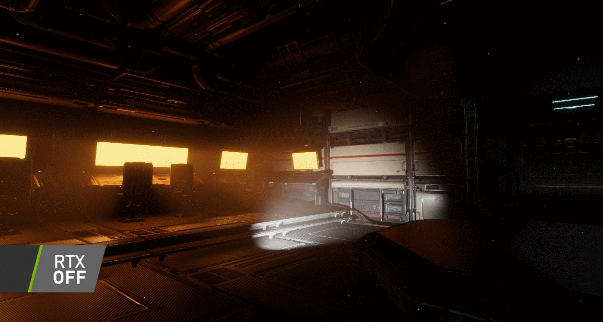

# miniRT

## # Goal
- Generate images using the Raytracing protocol.
- Those computer generated images will each represent a scene as seen from a specific angle and position defined by simple geometric objects and each with its own lighting system.

## Rules

- Need at least 3 geometric objects: plane, sphere, cylinder.
- All possible intersections and inside of the object must be handled correctly.
- Able to resize the object(eg diameter of sphere)
- Transition and rotate object light and camera
- Light management: spot brightness, hard shadows, ambiance lighting(object are never completely in the dark). Implement ambient and diffuse lighting.

## miniLibx
Pressing ESC close the window and quit the program cleanly.
Clicking on the red cross quit cleanly
Use images of miniLibx

## Arguments
./miniRT  (*.rt)
.rt contain

A 0.2 255,255,255
C -50.0,0,20 0,0,1 70
L -40.0,50.0,0.0 0.6 10,0,255
sp 0.0,0.0,20.6 12.6 10,0,255
pl 0.0,0.0,-10.0 0.0,1.0,0.0 0,0,255

A for Ambient Lightning.

- 0.2 between 0 to1 ambient lighting ratio
- Rest RGB color in range [0-255] eg 255,255,255 100% red, 100% green and 100% blue

C for Camera

- first is x,y,z coordinates of the view
- 2nd is normalized orientation vector. Range between [-1, 1]
- Last is FOV: Horizontal field of view between [0 to 180degree]

L for Light

- First is x, y, z co-ordinates
- 2nd is light brightness ratio between [0 to 1]
- last is RGB color not needed on mandatory part

sp for Sphere

- x, y, z co-ordinates first.
- Sphere diameter 2nd
- last is RGB color

pl for for plane

- x, y, z coordinates
- 3d Normalized vector of axis of cylinder in range [-1, 1]
- RGB color

cy for cylinder

- x, y, z coordinates
- 3d normalized vector of axis of cylinder between range [-1, 1] for each x, y, z axis.
- Cylinder diameter
- Cylinder height
- RGB color at last.
